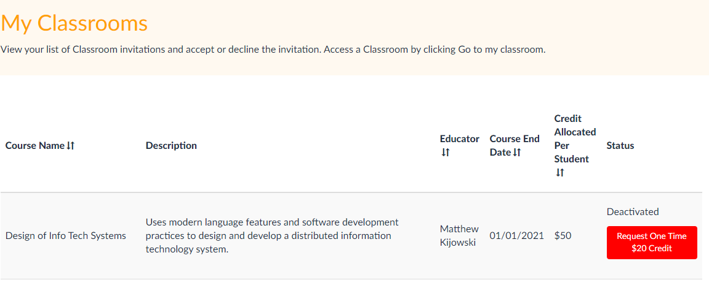
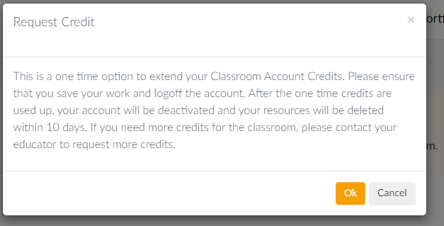
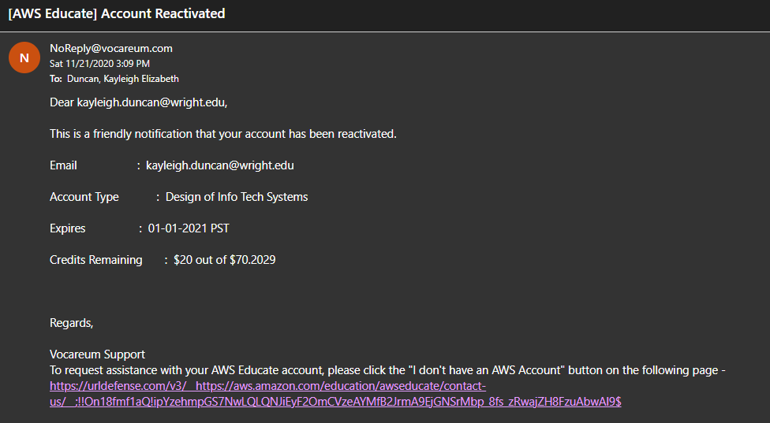
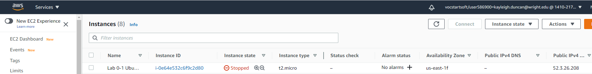
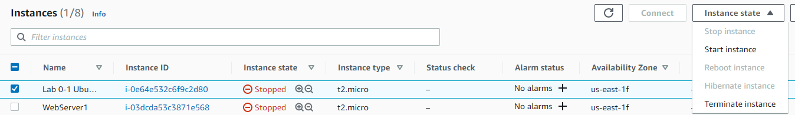
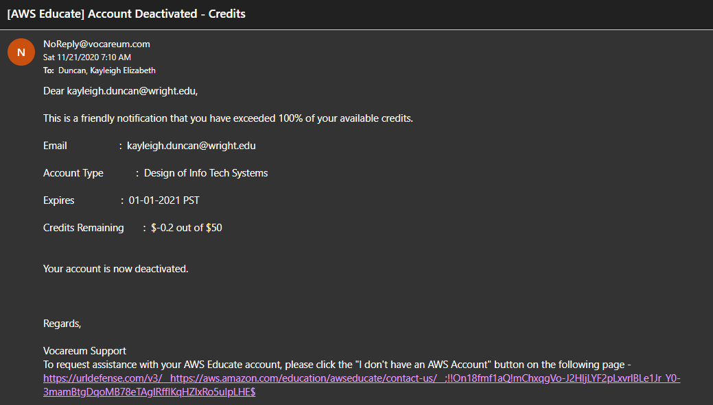
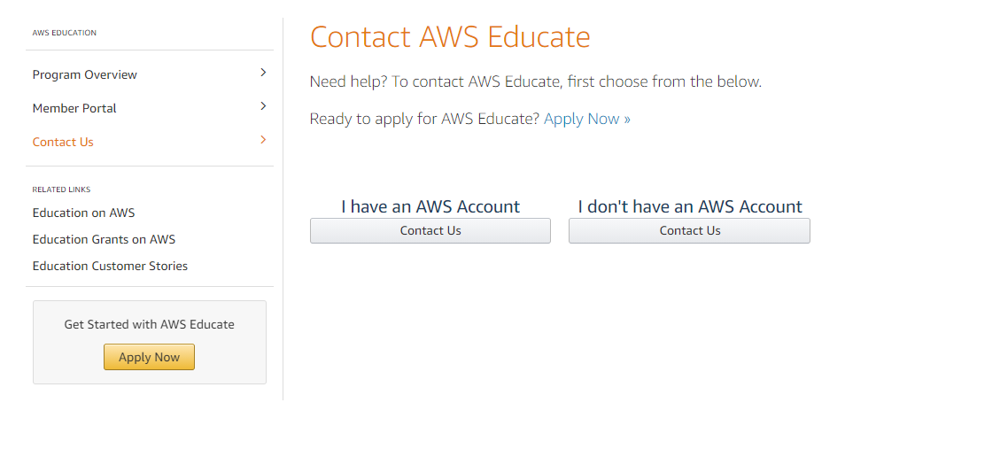
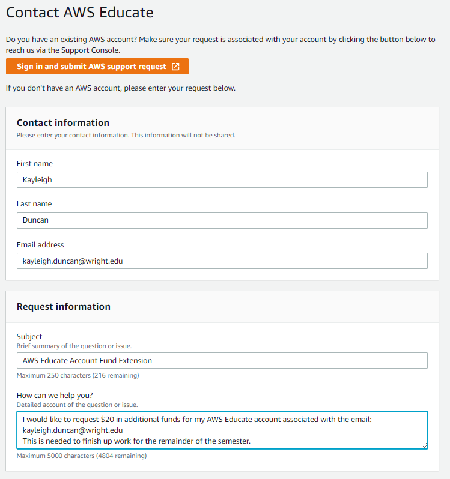

# AWS Out of Funds Steps

**Updated 11/21/2020**

### AWS Educate Quick Link:

- [Sign in to AWS educate](https://www.awseducate.com/signin/SiteLogin)

1. Log back into your AWS Educate account. A prompt should show up such as this:
   - NOTE: This could take a while, check back now and then.
   - If you did **not** see this prompt, go the the form details at the end.
     
2. A prompt will show up, click "Okay":  
   
3. You will get an email that your account has been reinstated:  
   
4. Enable your instance again: - Log out and back in to your AWS educate account - Go to the Serves dropdown and select "EC2" under "Compute" - Select "Instances (All States)"  
    - Click the check box for your instance. - If you have more than one, click the one that uses the elastic IP you have been using - Click the "Instance State" dropdown menu - Click "Start Instance"
   

## If No Button in "My Classrooms"

1. Sample out of funds email. Click on link in email.  
   
2. Select **I don't have an AWS account**  
   
3. Fill out the form. A sample is below:  
   
